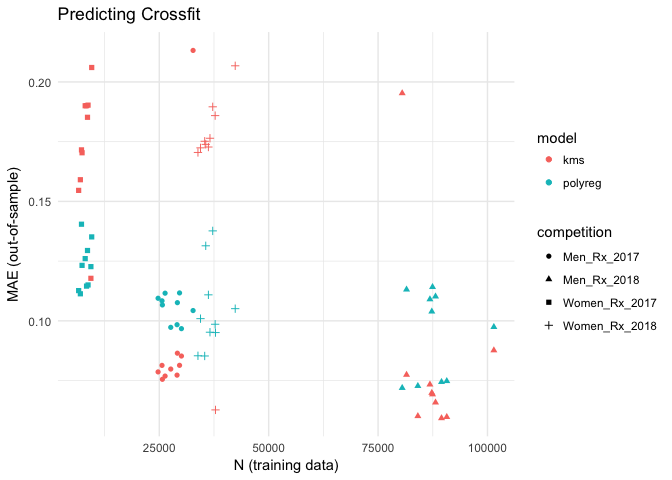

Crossfit Data
================

``` r
library(kerasformula)
library(polyreg)
library(ggplot2)
seed <- 1234
pTraining <- 0.9
```

Below find publically-available data from the Crossfit annual open, an amateur athletics competition consisting of five workouts each year. "Rx", as in "perscription", denotes the heaviest weights and most complex movements. In this analysis, we restrict the predictors to height, weight, age, region, and performance in the first of the five rounds. We also restrict analysis who did all five rounds "Rx" and reported that other data. The analysis is repeated for men and women and 2017 and 2018. In each case, `kerasformula` and `xvalPoly` are compared in terms of mean absolute error. (Note `kms` will standardize the outcome by default and so the test stats are on the same scale).

Men 2018 Competition
====================

``` r
competitions <- c("Men_Rx_2018", "Men_Rx_2017", "Women_Rx_2018", "Women_Rx_2017")

MAE_results <- matrix(nrow = choose(5,2)*4*2, ncol=8)
colnames(MAE_results) <- c("MAE", "model", "competition", "openA", "openB", "seed", "N", "P")
MAE_results <- as.data.frame(MAE_results)

# which_opens
include_opens <- paste0("open", 1:5, "percentile")

r <- 1 # row of MAE_results
P <- 6

for(i in 1:4){
  
  Rx <- read.csv(paste0(competitions[i], ".csv"))   # slow step... data.table?
  colnames(Rx) <- gsub("[[:punct:]]", "", colnames(Rx))    # forgetmenot
  colnames(Rx) <- tolower(colnames(Rx))
  colnames(Rx) <- gsub("x18", "open", colnames(Rx))
  colnames(Rx) <- gsub("x17", "open", colnames(Rx))
  Rx_tmp <- dplyr::select(Rx, heightm, weightkg, age, overallpercentile)
  
  for(j in 1:4){
    for(k in (j+1):5){
      
       Rx_tmp2 <- cbind(Rx_tmp, Rx[[include_opens[j]]], Rx[[include_opens[k]]])
       Rx_complete <- Rx_tmp2[complete.cases(Rx_tmp2), ]
       
       Rx_kms_out <- kms(overallpercentile ~ ., Rx_complete, 
                    layers = list(units = c(P, P, NA), 
                                activation = c("relu", "relu", "linear"), 
                                dropout = c(0.4, 0.3, NA), 
                                use_bias = TRUE, 
                                kernel_initializer = NULL, 
                                kernel_regularizer = "regularizer_l1_l2", 
                                bias_regularizer = "regularizer_l1_l2", 
                                activity_regularizer = "regularizer_l1_l2"),
                  seed=seed, Nepochs=5, 
                  validation_split = 0, pTraining = pTraining, verbose=0)
       Rx_complete_01 <- as.data.frame(lapply(Rx_complete, kerasformula:::zero_one))
       xval.out <- xvalPoly(Rx_complete_01, 
                          maxDeg = 3, maxInteractDeg = 2, 
                          nHoldout = floor(pTraining*nrow(Rx_complete)))
       
       MAE_results$MAE[r] <- Rx_kms_out$MAE_predictions
       MAE_results$MAE[r+1] <- min(xval.out)
       MAE_results$model[r] <- "kms"
       MAE_results$model[r+1] <- "polyreg"
       MAE_results$competition[r:(r+1)] <- competitions[i]
       # which rounds used to predict final
       MAE_results$openA[r:(r+1)] <- include_opens[[j]]
       MAE_results$openB[r:(r+1)] <- include_opens[[k]]
       MAE_results$seed[r:(r+1)] <- seed
       MAE_results$N[r:(r+1)] <- floor(pTraining*nrow(Rx_complete))
       MAE_results$P[r:(r+1)] <- Rx_kms_out$P
       r <- r + 2
       cat("finished simulation", r, "\n")
    }
  }  
  cat("finished", competitions[i], "\n")
}

MAE_results$openA <- gsub("percentile", " ", MAE_results$openA)
MAE_results$openB <- gsub("percentile", " ", MAE_results$openB)
```

The results
===========

Out-of-sample mean absolute error (MAE) for `kms` vs. `xvalPoly` (for the latter, the lowest MAE for the models corresponding to the three polynomial degrees is selected).

``` r
ggplot(MAE_results, aes(x = N, y  = MAE, color = model, pch=competition)) + geom_point() + 
  labs(title="Predicting Crossfit", y="MAE (out-of-sample)", x="N (training data)")
```


